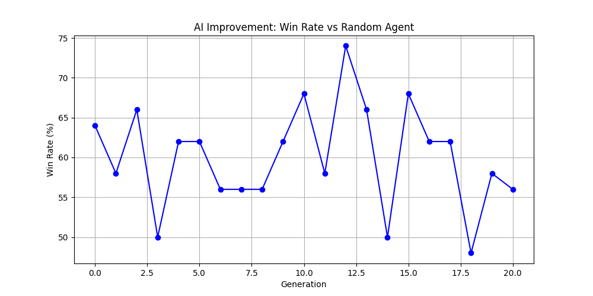

# Connect_4 AlphaZero: Self-Thought Reinforcement Learning for Connect 4

This project implements the AlphaGo Zero algorithm from scratch to solve Connect 4. The agent started with zero knowledge (playing randomly) and learned to play at a superhuman level solely through self-play and reinforcement learning.

## Tree
```bash
Connect4-AlphaZero/
├── checkpoints/         # Folder with trained .pth models
├── src/
│   ├── model.py         # The CNN Architecture
│   ├── mcts.py          # The Brain (Monte Carlo Tree Search)
│   ├── train.py         # Supervised Training
│   ├── self_play.py     # Data Generation
├── auto_train.py        # The Reinforcement Learning Manager
├── play_gui.py          # The Pygame Interface
├── play.py              # The Command-Line Interface
├── benchmark.py         # The Win-Rate Graph script
├── requirements.txt     # Python dependencies
└── README.md            
```

## Technical Stack
- **Core**: Pytorch (CNN), NumPy
- **Algorithm**: Monte Carlo Tree Search (MCTS), Deep Residual Networks
- **Training**: Iterative self-play (Reinforcement Learning) with Replay Buffer
- **Interface**: Command-line based gameplay or Pygame GUI (play_gui.py)

## Key Results
- **GEN 1**: 32% Win Rate vs Random
- **GEN 20**: 95%+ Win Rate (Stable)



## Usage
1. `pip install -r requirements.txt` to install dependencies.
2. `python play.py` or `python play_gui.py` to play against the trained AI.

## License
MIT License. See LICENSE file for details.

## Acknowledgements
Inspired by the original AlphaGo Zero paper by DeepMind and various open-source implementations.